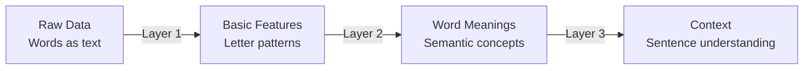
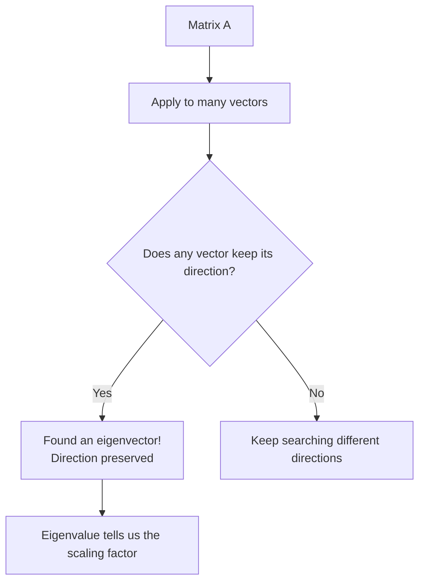
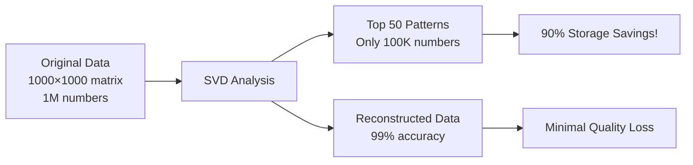
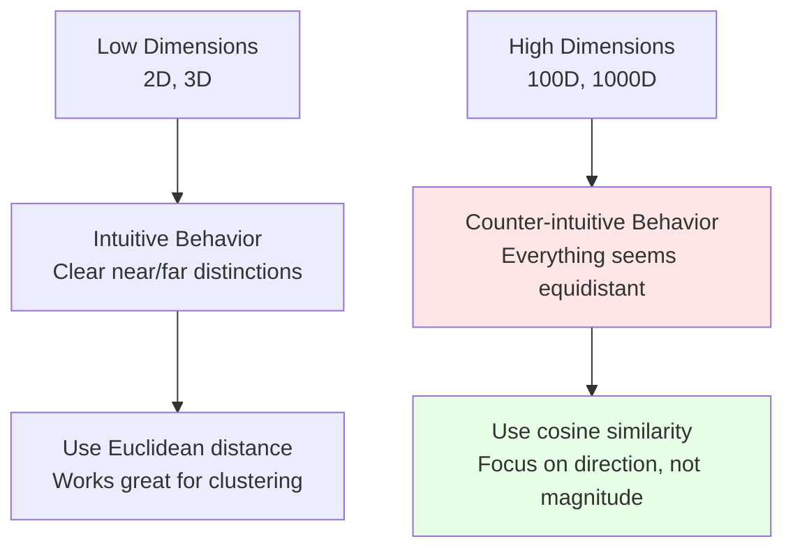

# Linear Algebra Refresher

**Updated:** 2025-07-22

## TL;DR

* **Vectors and matrices** are like the building blocks of AI - they help computers understand and manipulate data
* **Breaking down complex problems** (like SVD) helps us find hidden patterns in data
* **Measuring distances and stability** ensures our AI models train smoothly and give reliable results
* **Every AI operation** - from understanding language to generating images - uses these mathematical tools under the hood

---

## Quick Reference Guide

| Concept | What It Does | Why It Matters |
|---------|-------------|----------------|
| **Dot product** | Measures how similar two vectors are | Used everywhere in AI for similarity |
| **Matrix multiply** | Combines transformations | How neural networks process information |
| **Vector length** | Measures the "size" of a vector | Important for normalizing data |
| **SVD** | Finds the most important patterns | Compresses data while keeping key info |

---

## Understanding the Basics

### 1. Vectors and Vector Spaces - Your Data's Home

**Think of vectors like GPS coordinates.** Just as your location can be described with latitude and longitude, any piece of data can be represented as a list of numbers (a vector).

**What's a Vector Space?**
Imagine a coordinate system where each axis represents a different feature of your data:

- **2D example**: A house might be `[bedrooms, bathrooms]` = `[3, 2]`
- **3D example**: A color might be `[red, green, blue]` = `[255, 128, 0]`
- **High-D example**: A word in AI might be `[meaning1, meaning2, ..., meaning300]`

**Key Ideas:**

- **Span**: All the places you can reach by combining your directions
- **Linear independence**: When directions don't overlap (like north vs. east)
- **Basis**: The minimum set of directions needed to reach anywhere

**Real-World Example:**
```
Recipe vectors in a cooking app:
- Pizza: [flour=2, cheese=1, tomato=1, meat=0.5]
- Salad: [flour=0, cheese=0.2, tomato=0.8, meat=0.3]

The "span" includes all possible recipes you can make!
```

**Change of Basis - New Perspectives:**
When we transform `P^{-1}AP`, we're like changing from Celsius to Fahrenheit - same temperature, different scale. In AI, each layer of a neural network creates a new "perspective" on the data.



### 2. Eigenvalues and Eigenvectors - Finding Special Directions

**Simple Explanation:** Imagine you're stretching a rubber sheet. Most directions get distorted, but some special directions only get longer or shorter - they don't change direction. These are eigenvectors!

**The Math:** If `Av = λv`, then:

- **v** is the eigenvector (the special direction)
- **λ** (lambda) is the eigenvalue (how much it stretches)

**Step-by-Step Process:**

1. **Set up the problem**: `(A - λI)v = 0`
2. **Find the eigenvalues**: Solve `det(A - λI) = 0`
3. **Find the eigenvectors**: For each λ, solve `(A - λI)v = 0`

**Visual Understanding:**

- **Positive eigenvalue**: Vector stretches in same direction
- **Negative eigenvalue**: Vector flips and stretches  
- **Eigenvalue = 1**: No change (identity)
- **Eigenvalue between 0 and 1**: Shrinks
- **Complex eigenvalues**: Rotation happens

**Concrete Example:**
```
Matrix A = [3  1]
           [0  2]

Step 1: Find eigenvalues
det([3-λ  1  ]) = (3-λ)(2-λ) = 0
   ([0  2-λ])

Solutions: λ₁ = 3, λ₂ = 2

Step 2: Find eigenvectors
For λ₁ = 3: eigenvector = [1]
                          [0]
For λ₂ = 2: eigenvector = [1]
                          [0]
```

**AI Application Example:**
In recommendation systems, eigenvectors help find the most important user preferences. If users rate movies, the dominant eigenvector might represent "action vs. drama preference."

> **Fun Fact for AI:** Google's PageRank algorithm uses eigenvectors to rank web pages! The eigenvector with the largest eigenvalue tells us which pages are most important.



### 3. Singular Value Decomposition (SVD) - The Ultimate Data Analyzer

**The Big Picture:** SVD is like having X-ray vision for data. It shows you the most important patterns hidden inside any dataset.

**What SVD Does:**
Every matrix (think: data table) can be broken into three simpler pieces:
$$A = U\Sigma V^T$$

Think of it like this:

- **U**: How rows relate to patterns
- **Σ** (Sigma): How important each pattern is  
- **V^T**: How columns relate to patterns

**Step-by-Step Breakdown:**

1. **Start with your data matrix A** (like a spreadsheet)
2. **Compute A^T A** and find its eigenvalues/eigenvectors
3. **Extract the components**:
   - Singular values: σᵢ = √(eigenvalues)
   - Right singular vectors: V (from eigenvectors of A^T A)
   - Left singular vectors: U = AV/σ

**Why SVD is Amazing:**

- **Data compression**: Keep only the biggest patterns
- **Noise removal**: Small patterns are often just noise
- **Dimension reduction**: Project high-D data to low-D space
- **Missing data**: Fill in gaps using known patterns

**Real-World Example - Movie Recommendations:**
```
Original data (users × movies):
           Action1  Romance1  Comedy1  Action2
Alice         5        1        2        4
Bob           1        5        4        2  
Carol         4        2        3        5

SVD reveals hidden patterns:
Pattern 1: "Action lovers" (Alice, Carol like action)
Pattern 2: "Romance lovers" (Bob likes romance/comedy)
```

**Low-Rank Approximation Magic:**
Instead of storing all the data, keep only the top k patterns:
$$A_k = \sum_{i=1}^k \sigma_i u_i v_i^T$$

**Example**: Netflix doesn't store every user rating. Instead, it stores patterns like "sci-fi preference" and "comedy preference" and reconstructs ratings from these patterns!



**AI Applications:**
- **Language models**: Compress word embeddings from 300D to 50D
- **Image processing**: JPEG compression uses similar ideas
- **Recommendation systems**: Find user preference patterns

### 4. Norms and Conditioning - Measuring Distance and Stability

**Understanding Norms - Different Ways to Measure Size:**

Think of norms like different ways to measure how far you've traveled:

**Vector Norms:**

- **L1 norm (Manhattan distance)**: `||v||₁ = |v₁| + |v₂| + ... + |vₙ|`
  - *Like walking in a city* - you can only go along streets (no diagonal shortcuts)
  - Example: To go from (0,0) to (3,4), you walk 3 blocks + 4 blocks = 7 blocks

- **L2 norm (Euclidean distance)**: `||v||₂ = √(v₁² + v₂² + ... + vₙ²)`
  - *Like flying in a straight line* - the direct path
  - Example: From (0,0) to (3,4) is √(3² + 4²) = √25 = 5 units

- **L∞ norm (Maximum norm)**: `||v||∞ = max(|v₁|, |v₂|, ..., |vₙ|)`
  - *Like the bottleneck* - limited by your worst dimension
  - Example: From (0,0) to (3,4), the max is 4

**Visual Example:**
```
Vector v = [3, 4]

L1 norm: |3| + |4| = 7     (Manhattan distance)
L2 norm: √(3² + 4²) = 5    (Straight line)
L∞ norm: max(3, 4) = 4     (Largest component)
```

**Matrix Norms:**

- **Frobenius norm**: `||A||F = √(sum of all squares)`
  - Like measuring the "total energy" in a matrix

- **Spectral norm**: `||A||₂ = largest singular value`
  - Like measuring the "maximum stretch" a matrix can cause

**Condition Numbers - Stability Detector:**

The condition number `κ(A) = ||A|| × ||A^{-1}||` tells you how "sensitive" your problem is:

- **κ(A) ≈ 1**: Well-behaved (small input changes → small output changes)
- **κ(A) > 1000**: Dangerous! (tiny input changes → huge output changes)

**Simple Analogy:**
Imagine you're following GPS directions:

- **Well-conditioned** (κ ≈ 1): Being 1 meter off course keeps you 1 meter off target
- **Ill-conditioned** (κ >> 1): Being 1 meter off course puts you in a different city!

**Examples:**
```
Well-conditioned matrix:     Ill-conditioned matrix:
A = [1   0]                 A = [1     1000]
    [0   1]                     [0        1]
κ(A) = 1                    κ(A) = 1000

Effect: Stable, predictable  Effect: Tiny errors explode!
```

**Impact on AI Training:**

When training neural networks with ill-conditioned problems:

- **Gradients explode**: Learning becomes unstable
- **Gradients vanish**: Learning stops completely
- **Solutions**: 
  - Use smaller learning rates
  - Add gradient clipping  
  - Use better optimizers (Adam, RMSprop)
  - Add normalization layers (BatchNorm, LayerNorm)

### 5. High-Dimensional Geometry - When Intuition Breaks Down

**The Weird World of High Dimensions:**

Our everyday intuition about space (3D) completely breaks down when we have hundreds or thousands of dimensions. Strange things happen:

**Key Phenomena:**

1. **Distance Concentration**: 
   - In low dimensions: Some points are close, others far
   - In high dimensions: Almost all points are the same distance apart!

2. **Volume Concentration**: 
   - Most of a high-dimensional sphere's volume is near its surface
   - The "center" is essentially empty

3. **Random Orthogonality**: 
   - Random vectors become nearly perpendicular to each other
   - Cosine of angle between vectors approaches 0

**Why This Matters for AI:**

**Similarity Search Problems:**
```
In 2D: Easy to find nearest neighbors
• • •     ← Clear clusters
  •••
    •

In 1000D: Everything seems equally distant!
All points look like: • • • • • • • • • •
```

**Practical Implications:**

- **Euclidean distance fails**: All distances become similar
- **Cosine similarity works better**: Focus on angles, not absolute distances
- **Need careful threshold tuning**: What counts as "similar" changes dramatically

**Real Example - Word Embeddings:**
```
2D word space (simplified):
- "cat" vs "dog": distance = 0.3
- "cat" vs "car": distance = 0.8
- Clear difference!

300D word space (realistic):
- "cat" vs "dog": distance = 4.2
- "cat" vs "car": distance = 4.3  
- Barely different!

Solution: Use cosine similarity instead
- "cat" vs "dog": cos_sim = 0.85 (similar direction)
- "cat" vs "car": cos_sim = 0.12 (different direction)
```



---

## How This Connects to AI Systems

### The Attention Mechanism - Linear Algebra in Action

The famous "attention" mechanism that powers ChatGPT and other language models is essentially a sophisticated sequence of matrix operations:

```mermaid
graph TB
    X[Input: "The cat sat on the mat"<br/>Converted to numbers] --> WQ[Query Matrix<br/>What am I looking for?]
    X --> WK[Key Matrix<br/>What information do I have?]
    X --> WV[Value Matrix<br/>What should I output?]
    
    WQ --> Q[Q = Queries<br/>Questions about each word]
    WK --> K[K = Keys<br/>Features of each word]
    WV --> V[V = Values<br/>Information to extract]
    
    Q --> SCORES[Similarity Scores<br/>How much does each word<br/>relate to others?]
    K --> SCORES
    
    SCORES --> SOFT[Softmax<br/>Convert to probabilities]
    SOFT --> WEIGHT[Attention Weights<br/>How much to focus on each word]
    WEIGHT --> V
    V --> OUT[Final Output<br/>Contextual understanding]
```

**Step-by-Step Breakdown:**

1. **Convert words to numbers**: Each word becomes a vector of numbers
2. **Create three views**: Generate queries (what to look for), keys (what's available), and values (what to extract)
3. **Calculate similarities**: Use dot products to see which words relate to each other
4. **Apply attention**: Focus more on relevant words, less on irrelevant ones
5. **Combine information**: Mix the values based on attention weights

**Mathematical Flow:**
1. **Project inputs**: `Q = XW_Q`, `K = XW_K`, `V = XW_V`
2. **Compute attention scores**: `S = QK^T / √d_k` (scaled dot products)
3. **Apply softmax**: `A = softmax(S)` (convert to probabilities)
4. **Weighted combination**: `Output = AV` (final result)

**Why the scaling factor `√d_k`?**
Without it, the dot products become huge in high dimensions, making the softmax too "sharp" (all attention goes to one word). Scaling helps keep the volume manageable.

### Vector Databases and RAG Systems

**How AI Retrieves Information:**

Modern AI systems don't memorize everything. Instead, they store information in vector databases and retrieve relevant pieces when needed:

```mermaid
graph LR
    Q[User Question<br/>"How does photosynthesis work?"] --> E[Convert to Vector<br/>[0.2, -0.5, 0.8, ...]]
    E --> S[Search Vector Database<br/>Find similar vectors]
    S --> M[Retrieve Matching Documents<br/>Biology textbooks, articles]
    M --> C[Combine with Question<br/>Provide context to AI]
    C --> A[Generate Answer<br/>Using retrieved knowledge]
```

**The Math Behind It:**
- **Embedding**: Convert text to high-dimensional vectors
- **Similarity search**: Use cosine similarity or dot products
- **Approximate nearest neighbor**: Fast algorithms for large databases

### Planning and State Representation

**For AI Agents and Robotics:**

- **State vectors**: Current situation as numbers
- **Action matrices**: How decisions change the state  
- **Value functions**: How good each state is
- **Policy matrices**: What action to take in each state

**Example - Game Playing AI:**
```
Chess board state: [piece_positions, whose_turn, castling_rights, ...]
Action matrix: All possible moves as transformations
Value function: How likely to win from this position
```

---

## Practical Examples with Code

### Example 1: Understanding Attention Scores
```python
import numpy as np

def simple_attention_example():
    """
    Example: Understanding what words in a sentence 
    should pay attention to each other
    """
    # Sentence: "The cat sat on the mat"
    # Simplified word vectors (normally 300+ dimensions)
    words = {
        'the': [1, 0, 0],
        'cat': [0, 1, 0.8],  # Animal-like
        'sat': [0, 0.3, 1],  # Action
        'on': [0.1, 0, 0.2], # Preposition
        'mat': [0, 0.2, 0.1] # Object
    }
    
    # Create matrices (simplified)
    sentence = np.array(list(words.values()))
    
    # Compute attention (which words relate to which)
    attention_scores = np.dot(sentence, sentence.T)
    
    print("Attention scores (higher = more related):")
    word_list = list(words.keys())
    for i, word1 in enumerate(word_list):
        for j, word2 in enumerate(word_list):
            print(f"{word1} -> {word2}: {attention_scores[i,j]:.2f}")
    
    return attention_scores

# This shows how "cat" and "mat" are related (subject-object relationship)
```

### Example 2: Dimensionality Reduction with SVD
```python
def movie_recommendation_svd():
    """
    Example: How Netflix-style recommendations work
    using SVD to find hidden patterns
    """
    # User ratings (users × movies)
    # -1 means not rated
    ratings = np.array([
        [5, 1, 3, -1, 2],  # Alice: loves action, hates romance
        [1, 5, 4,  3, 5],  # Bob: loves romance and comedy
        [4, 2, 5, -1, 3],  # Carol: likes action and comedy
        [-1, 4, 2, 4, 4],  # Dave: mixed preferences
    ])
    
    # Replace missing ratings with average
    for i in range(ratings.shape[0]):
        for j in range(ratings.shape[1]):
            if ratings[i,j] == -1:
                # Use user's average rating
                user_ratings = ratings[i, ratings[i] != -1]
                ratings[i,j] = np.mean(user_ratings)
    
    # Apply SVD
    U, sigma, Vt = np.linalg.svd(ratings, full_matrices=False)
    
    # Keep only top 2 patterns (compressed representation)
    k = 2
    compressed = U[:, :k] @ np.diag(sigma[:k]) @ Vt[:k, :]
    
    print("Original vs Compressed ratings:")
    print("Original:")
    print(ratings)
    print("\nCompressed (using top 2 patterns):")
    print(compressed.round(2))
    
    return compressed

# This shows how we can predict missing ratings using patterns
```

### Example 3: High-Dimensional Distance Problems
```python
def dimension_curse_demo():
    """
    Demonstrate how distance becomes meaningless 
    in high dimensions
    """
    dimensions = [2, 10, 100, 1000]
    
    for d in dimensions:
        # Generate random points
        n_points = 1000
        points = np.random.randn(n_points, d)
        
        # Calculate all pairwise distances
        distances = []
        for i in range(n_points):
            for j in range(i+1, n_points):
                dist = np.linalg.norm(points[i] - points[j])
                distances.append(dist)
        
        distances = np.array(distances)
        
        print(f"\nDimension {d}:")
        print(f"Mean distance: {distances.mean():.2f}")
        print(f"Distance std: {distances.std():.2f}")
        print(f"Relative variation: {distances.std()/distances.mean():.3f}")
        
        # As dimensions increase, relative variation decreases!
        # Everything becomes equidistant

# This shows why we need different similarity measures in high-D
```

---

## Common Questions Answered Simply

**Q: Why is math important for AI? I just want to use ChatGPT.**  
**A:** Think of it like driving a car. You don't need to understand every engine part to drive, but knowing basics helps you drive better, troubleshoot problems, and understand why your car behaves certain ways. Same with AI!

**Q: What's the difference between SVD and eigendecomposition?**  
**A:** SVD works on any rectangular data table (like Netflix ratings), while eigendecomposition only works on square matrices. SVD is like a universal tool that works everywhere.

**Q: Why do we scale attention scores by `1/√d_k`?**  
**A:** Imagine shouting in a small room vs. a big concert hall. In high dimensions, dot products become like shouting in a concert hall - they get really loud. Scaling helps keep the volume manageable.

**Q: When should I use cosine similarity instead of regular distance?**  
**A:** Use cosine similarity when you care about "direction" rather than "size." For example:
- Document similarity: "cat, cats, kitten" vs "CAT, CATS, KITTEN" should be similar despite different lengths
- Recommendation systems: Users with same preferences but different rating scales

**Q: How do I know if my data is suitable for compression (low-rank approximation)?**  
**A:** Look at your singular values after SVD. If they drop quickly (like 1000, 500, 100, 50, 10, 1, 0.1...), you can compress well. If they decrease slowly, compression won't help much.

**Q: Why does my neural network training become unstable?**  
**A:** Often it's a conditioning problem! Your gradients are too sensitive. Try:
- Smaller learning rates
- Better optimizers (Adam instead of SGD)
- Gradient clipping
- Layer normalization

**Q: What's the intuition behind eigenvectors?**  
**A:** They're the "natural directions" of your transformation. Like finding the grain in wood - when you split along the grain (eigenvector), it's easy. Split against it, and it's hard.

---

**Remember:** Linear algebra isn't just abstract math - it's the language that lets computers understand patterns, make predictions, and generate creative content. Every time AI recognizes your voice, translates text, or recommends a movie, these mathematical tools are working behind the scenes!
