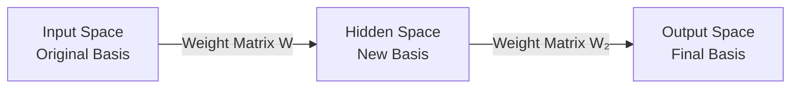
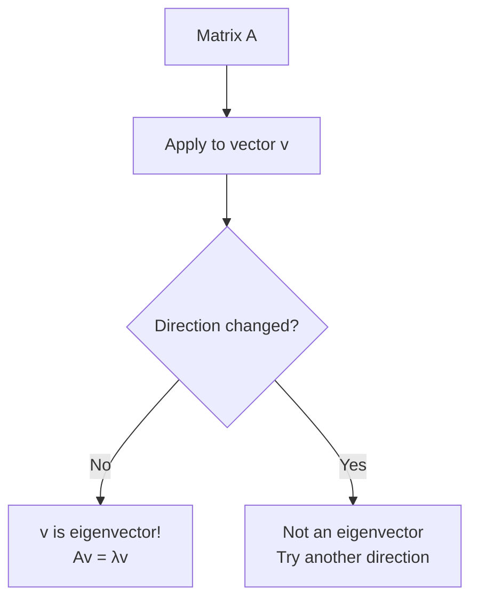
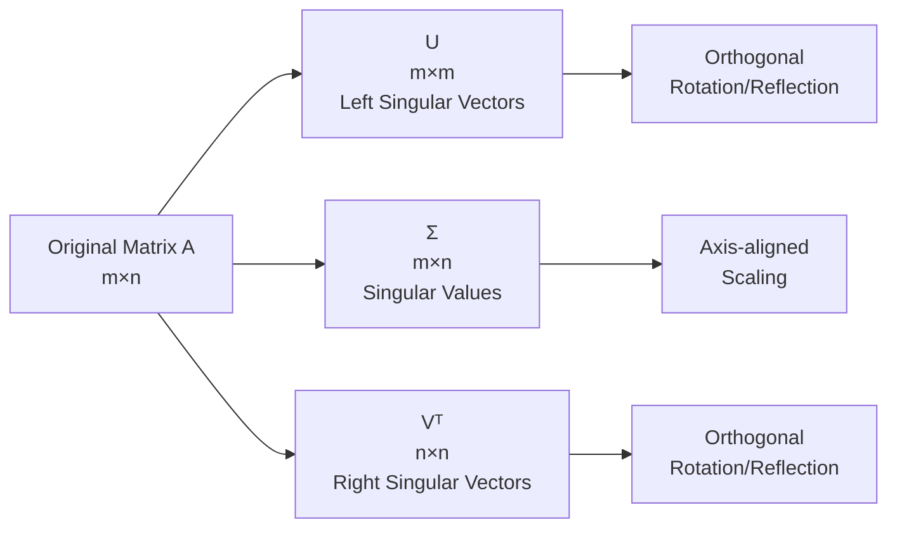
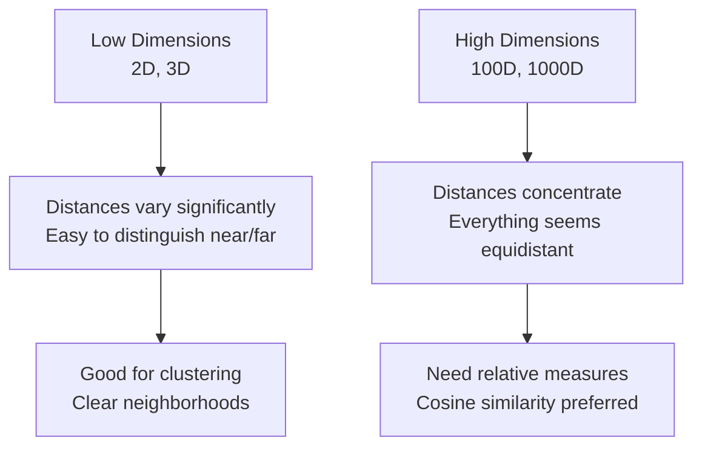
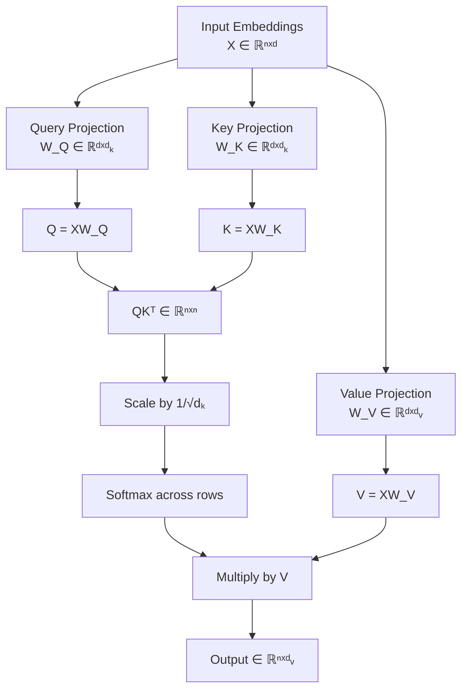

# Linear Algebra Refresher

**Updated:** 2025-07-22

## TL;DR

* Vectors, matrices, and tensors form the language of every deep-learning layer.
* Decompositions (eigen, SVD) expose latent structure—crucial for embeddings & pruning.
* Norms and conditioning dictate the stability and speed of optimization.
* Nearly every agentic operation (attention, memory updates, planning projections) is a chain of matrix multiplies.

---

## Cheatsheet

| Concept         | Formula                                  | Intuition                                   |
|-----------------|------------------------------------------|---------------------------------------------|
| Dot product     | $\mathbf{a}^T\mathbf{b}$                | Projection of **a** onto **b**             |
| Matrix multiply | $(AB)_{ij} = \sum_k A_{ik}B_{kj}$       | Compose linear maps                         |
| Frobenius norm  | $\|A\|_F = \sqrt{\sum_{ij}A_{ij}^2}$    | Euclidean length of a matrix                |
| SVD             | $A = U\Sigma V^T$                        | Orthogonal rotations + axis-aligned scaling |
| L2 norm         | $\|\mathbf{v}\|_2 = \sqrt{\sum_i v_i^2}$ | Euclidean distance from origin             |
| Eigenvalue      | $A\mathbf{v} = \lambda\mathbf{v}$        | Direction preserved under transformation    |

---

## Deep Dive

### 1. Vector Spaces & Bases

**Core Concepts:**
- **Vector space**: A collection of objects (vectors) that can be added together and multiplied by scalars
- **Span**: All possible linear combinations of a set of vectors
- **Linear independence**: Vectors that cannot be expressed as combinations of others
- **Basis**: A linearly independent set that spans the entire space

**Key Properties:**
```
Span({v₁, v₂, ..., vₖ}) = {a₁v₁ + a₂v₂ + ... + aₖvₖ | aᵢ ∈ ℝ}
```

**Change of Basis:**
When we have a linear transformation $A$ and want to express it in a new coordinate system with basis $P$:
$$P^{-1}AP$$
This re-expresses the linear map in the new coordinate frame.

**Practical Example:**
In neural networks, each layer learns a new basis representation of the input data. The weight matrices perform these basis transformations.



### 2. Eigenvalues & Eigenvectors

**Definition:**
An eigenvector $\mathbf{v}$ of matrix $A$ is a non-zero vector that doesn't change direction when $A$ is applied to it:
$$A\mathbf{v} = \lambda\mathbf{v}$$

where $\lambda$ is the eigenvalue (scaling factor).

**Finding Eigenvalues:**
1. Set up the characteristic equation: $(A - \lambda I)\mathbf{v} = 0$
2. For non-trivial solutions: $\det(A - \lambda I) = 0$
3. Solve the characteristic polynomial

**Geometric Interpretation:**
- Eigenvalues tell us how much the transformation stretches/shrinks along eigenvector directions
- Positive eigenvalues: same direction
- Negative eigenvalues: opposite direction
- Complex eigenvalues: rotation involved

**Example for 2×2 Matrix:**
```
A = [3  1]    →    Eigenvalues: λ₁ = 4, λ₂ = 2
    [0  2]         Eigenvectors: v₁ = [1], v₂ = [1]
                                      [1]      [0]
```

> **Agentic Link:** Power iteration (one of the simplest RL planners!) repeatedly applies $A$ to approximate the dominant eigenvector—handy for ranking memory chunks or finding principal components in agent state representations.

**Visualization:**


### 3. Singular Value Decomposition (SVD)

**The Big Idea:**
Every matrix can be decomposed into three simpler matrices:
$$A = U\Sigma V^T$$

Where:
- $U$: Left singular vectors (orthonormal columns)
- $\Sigma$: Diagonal matrix of singular values (non-negative, decreasing)
- $V^T$: Right singular vectors (orthonormal rows)

**Step-by-Step Construction:**
1. Compute $A^TA$ and find its eigendecomposition → gives us $V$ and $\sigma_i^2$
2. Singular values: $\sigma_i = \sqrt{\lambda_i}$ where $\lambda_i$ are eigenvalues of $A^TA$
3. Left singular vectors: $U = AV\Sigma^{-1}$

**Why SVD Matters:**
- **Low-rank approximation**: Keep only top $k$ singular values
- **Dimensionality reduction**: Project onto principal directions
- **Noise reduction**: Small singular values often represent noise

**Low-Rank Approximation:**
$$A_k = \sum_{i=1}^k \sigma_i \mathbf{u_i} \mathbf{v_i}^T$$

This keeps only the $k$ most important "directions" in your data.

> **Neural Network Application:** Transformer weights can often be compressed using low-rank approximations ($k \ll d$) with negligible performance loss, making models faster and smaller.

**Visualization of SVD:**


### 4. Norms & Conditioning

**Vector Norms:**
- **L1 norm (Manhattan)**: $\|\mathbf{v}\|_1 = \sum_i |v_i|$
- **L2 norm (Euclidean)**: $\|\mathbf{v}\|_2 = \sqrt{\sum_i v_i^2}$
- **L∞ norm (Max)**: $\|\mathbf{v}\|_∞ = \max_i |v_i|$

**Matrix Norms:**
- **Frobenius norm**: $\|A\|_F = \sqrt{\sum_{ij} A_{ij}^2}$
- **Spectral norm**: $\|A\|_2 = \sigma_{\max}(A)$ (largest singular value)

**Condition Number:**
$$\kappa(A) = \|A\| \|A^{-1}\| = \frac{\sigma_{\max}(A)}{\sigma_{\min}(A)}$$

**What Condition Number Tells Us:**
- $\kappa(A) = 1$: Perfect conditioning (orthogonal matrices)
- $\kappa(A) > 1000$: Poorly conditioned, numerical instability likely
- High condition number → small changes in input cause large changes in output

**Impact on Training:**
Poor conditioning demands:
- Smaller learning rates
- Gradient clipping
- Preconditioning (LayerNorm, BatchNorm)
- Better optimizers (Adam, RMSprop)

**Example:**
```
Well-conditioned:     Ill-conditioned:
A = [1  0]           A = [1    1000]
    [0  1]               [0      1]
κ(A) = 1             κ(A) = 1000
```

### 5. High-Dimensional Geometry

**The Curse of Dimensionality:**
As dimensions increase, strange things happen:
- Most volume concentrates near the surface of spheres
- Random vectors become nearly orthogonal
- Distances between points become more uniform

**Key Insights:**
1. **Distance concentration**: In high dimensions, all pairwise distances become similar
2. **Orthogonality**: Random unit vectors have $\cos\theta \approx 0$ with high probability
3. **Volume concentration**: Most of a high-dimensional sphere's volume is near its surface

**Implications for AI:**
- **Similarity search**: Cosine similarity often works better than Euclidean distance
- **Embeddings**: Need careful threshold tuning for retrieval
- **Optimization**: Local minima become saddle points in high dimensions

**Visualization of Distance Concentration:**


---

### Attention Mechanism: Pure Linear Algebra

The transformer attention mechanism is fundamentally a sequence of linear algebra operations:



**Mathematical Flow:**
1. **Project inputs**: $Q = XW_Q$, $K = XW_K$, $V = XW_V$
2. **Compute attention scores**: $S = \frac{QK^T}{\sqrt{d_k}}$
3. **Apply softmax**: $A = \text{softmax}(S)$
4. **Weighted combination**: $O = AV$

---

## Why It Matters for Agents

### 1. Attention Mathematics
The core attention computation $O = \text{softmax}(QK^T/\sqrt{d_k})V$ is linear algebra until the softmax:
- Understanding projections helps debug head specialization
- Rank of attention matrices reveals information flow
- Singular values show which patterns dominate

### 2. Memory & RAG Systems
**Vector databases** for retrieval-augmented generation:
- Embeddings live in high-dimensional vector spaces
- Similarity search uses dot products or cosine similarity
- Approximate nearest neighbor (ANN) algorithms optimize these computations

```mermaid
graph LR
    Q[Query Vector] --> E[Embedding Space<br/>ℝᵈ]
    E --> S[Similarity Search<br/>cos(q,k) = qᵀk/(||q||||k||)]
    S --> R[Retrieve Top-K<br/>Most Similar Vectors]
    R --> C[Context for LLM]
```

### 3. Planning & State Representation
**Symbolic agents** use matrices for:
- **Adjacency matrices**: Represent state transitions
- **Eigenspectra**: Reveal connectivity and bottlenecks
- **Graph Laplacians**: Enable diffusion-based planning
- **Value function approximation**: Linear combinations of features

### 4. Multi-Agent Systems
**Communication matrices**:
- Rows/columns represent agents
- Entries represent communication strength/probability
- Eigenanalysis reveals group structures and information flow patterns

---

## Practical Examples & Code Snippets

### Example 1: Computing Attention Scores
```python
import numpy as np

def attention(Q, K, V, d_k):
    """Simplified attention computation"""
    # Compute raw attention scores
    scores = np.dot(Q, K.T) / np.sqrt(d_k)
    
    # Apply softmax
    attention_weights = np.exp(scores) / np.sum(np.exp(scores), axis=1, keepdims=True)
    
    # Weighted combination of values
    output = np.dot(attention_weights, V)
    return output, attention_weights
```

### Example 2: Low-Rank Matrix Approximation
```python
def low_rank_approximation(A, k):
    """Compress matrix using SVD"""
    U, s, Vt = np.linalg.svd(A, full_matrices=False)
    
    # Keep only top k components
    A_k = U[:, :k] @ np.diag(s[:k]) @ Vt[:k, :]
    
    compression_ratio = k * (A.shape[0] + A.shape[1]) / (A.shape[0] * A.shape[1])
    return A_k, compression_ratio
```

### Example 3: Condition Number Analysis
```python
def analyze_conditioning(A):
    """Analyze matrix conditioning"""
    cond_num = np.linalg.cond(A)
    
    if cond_num < 10:
        return "Well-conditioned"
    elif cond_num < 1000:
        return "Moderately conditioned"
    else:
        return "Ill-conditioned - expect numerical issues"
```

---

## Q & A

**Q:** Why prefer SVD over eigendecomposition for non-square matrices?  
**A:** SVD exists for *any* real matrix and yields orthonormal bases in both domain & codomain. Eigendecomposition only works for square matrices and may not have real eigenvalues/eigenvectors.

**Q:** How does high condition number affect training?  
**A:** It amplifies gradient noise and can cause training instability. Solutions include: lowering step size, gradient clipping, preconditioning (Adam, RMSprop), or architectural changes (LayerNorm, skip connections).

**Q:** Why do we scale attention scores by $1/\sqrt{d_k}$?  
**A:** Without scaling, dot products grow with dimension size, pushing softmax into saturation regions where gradients vanish. Scaling keeps the variance of attention scores constant regardless of dimension.

**Q:** When should I use cosine similarity vs. Euclidean distance?  
**A:** Use cosine similarity when you care about direction/angle rather than magnitude, especially in high dimensions where Euclidean distances concentrate. It's preferred for text embeddings and normalized feature vectors.

**Q:** How can I tell if my matrix is suitable for low-rank approximation?  
**A:** Plot the singular values - if they decay rapidly, the matrix has low effective rank. A good rule of thumb: if the first $k$ singular values capture 90%+ of the total "energy" ($\sum_{i=1}^k \sigma_i^2 / \sum_{i=1}^r \sigma_i^2$), then rank-$k$ approximation will work well.

---
