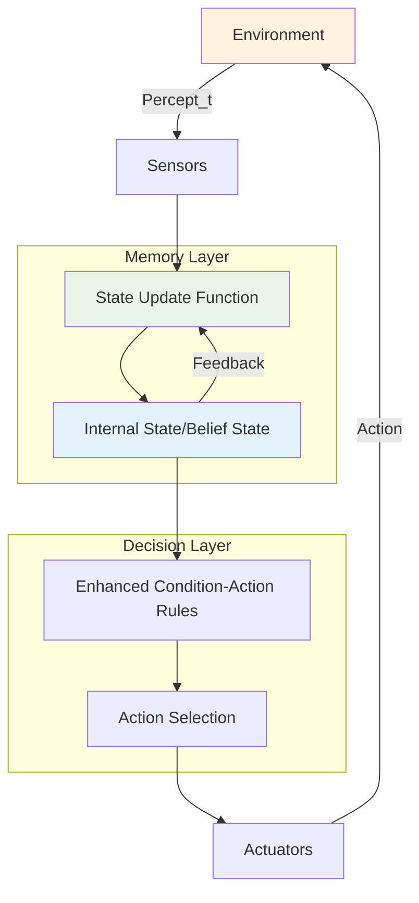
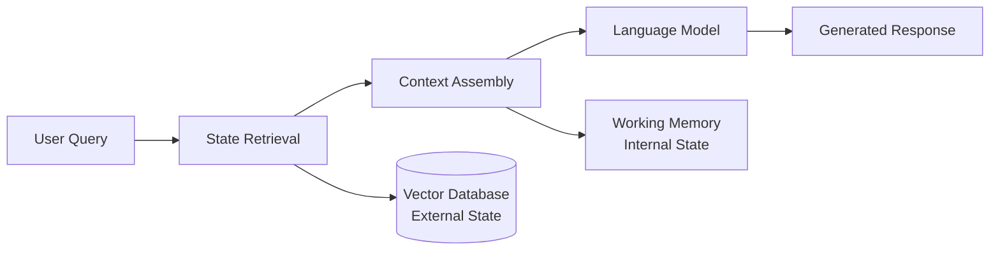

# Model-Based Reflex Agents

**Updated:** 2025-07-24

## TL;DR

* **Adds internal state**: Remembers aspects of the world that aren't in the current percept, creating a persistent memory layer
* **Maintains a world-model**: Often minimal but crucial for handling partial observability and temporal dependencies
* **Decision via enhanced rules**: Condition-action rules now evaluate **belief state** rather than raw sensory input
* **Evolutionary stepping stone**: Bridges the gap between reactive behavior and deliberative reasoning
* **Modern relevance**: Foundational concepts directly parallel memory mechanisms in generative AI systems

---

## Conceptual Foundation and Motivation

### The Memory Problem in Intelligence

The transition from simple reflex to model-based reflex agents represents a fundamental shift in artificial intelligence architecture - the introduction of **persistent internal state**. This evolution mirrors a crucial insight in cognitive science: intelligent behavior often requires maintaining information about the world beyond what is immediately observable.

**The Core Insight**: Real-world environments exhibit **partial observability** - agents cannot perceive all relevant information simultaneously. A vacuum robot cannot see dirt in rooms it's not currently occupying. A language model cannot access information beyond its training cutoff. A recommendation system cannot observe user preferences that haven't been explicitly stated.

### Philosophical Implications

Model-based reflex agents embody a **constructivist approach** to intelligence, where the agent actively builds and maintains an internal representation of reality. This contrasts with the purely reactive stance of simple reflex agents, which treat each moment as isolated from history.

This architectural choice introduces profound questions that resonate throughout AI:
- **Representation**: How do we encode relevant aspects of the world?
- **Updating**: When and how should beliefs change?
- **Accuracy**: How do we handle model-reality mismatches?
- **Scaling**: What happens as internal models grow complex?

These same questions drive modern research in large language models, world models, and memory-augmented neural networks.

### Connection to Generative AI

Modern generative AI systems face identical challenges. **Context windows** in transformers serve as explicit memory mechanisms. **Retrieval-Augmented Generation (RAG)** systems maintain external knowledge stores. **Few-shot learning** relies on conditioning models with relevant examples stored in the prompt.

The model-based reflex agent's **state update function** directly parallels how generative models update their internal representations as they process sequential inputs. The **belief state** corresponds to the latent representations that language models build about conversation context, user intent, and task requirements.

---

## Architecture and Information Flow

### Enhanced Architecture



### Information Processing Pipeline

**1. Perception Integration**
- Current sensory input combined with stored beliefs
- Temporal fusion of information across time steps
- Confidence weighting of observations vs. stored beliefs

**2. State Representation**
- **Symbolic state**: Discrete facts about the world (room cleanliness, object locations)
- **Metric state**: Continuous variables (positions, velocities, probabilities)
- **Hybrid representations**: Combining symbolic and continuous information

**3. Update Mechanisms**
- **Deterministic updates**: Direct state transitions based on observations
- **Probabilistic updates**: Bayesian belief revision under uncertainty
- **Temporal decay**: Old information becoming less reliable over time

**4. Rule Enhancement**
Rules now operate on enriched state rather than raw percepts:
```
Simple Reflex: if current_percept then action
Model-Based: if belief_state_condition then action
```

### Comparison with Modern AI Architectures

| Aspect | Model-Based Reflex | Modern LLMs | Generative AI Systems |
|--------|-------------------|-------------|----------------------|
| **Memory** | Explicit state variables | Attention mechanisms + context | RAG + vector databases |
| **Updates** | Deterministic functions | Gradient-based learning | Continuous pre-training |
| **Representation** | Hand-coded features | Learned embeddings | Multi-modal representations |
| **Scale** | Small, local state | Billions of parameters | Distributed knowledge bases |

---

## Detailed Operational Mechanics

### State Representation Strategies

**1. Complete State Tracking**
Maintain exhaustive information about all relevant world aspects:
- **Advantages**: Maximum information availability for decision-making
- **Challenges**: Memory explosion, computational overhead, staleness issues
- **Generative AI Parallel**: Full conversation history retention in chatbots

**2. Selective State Maintenance**
Store only task-relevant information with intelligent forgetting:
- **Relevance filtering**: Keep information likely to influence future decisions
- **Temporal prioritization**: Recent information weighted more heavily
- **Importance weighting**: Critical facts maintained longer
- **Generative AI Parallel**: Attention mechanisms focusing on relevant tokens

**3. Hierarchical State Organization**
Multi-level representations from detailed to abstract:
- **Operational details**: Immediate sensory information and action consequences
- **Tactical summaries**: Medium-term patterns and spatial relationships
- **Strategic context**: Long-term goals and environmental invariants
- **Generative AI Parallel**: Hierarchical prompt engineering and context compression

### Update Function Sophistication

**Basic Update Paradigms**:

**1. Overwrite Updates**
```
New observations completely replace previous beliefs
state['room_A_clean'] = current_observation
```
- Simple but loses historical context
- Appropriate for rapidly changing environments

**2. Confirmatory Updates**
```
New observations strengthen or weaken existing beliefs
confidence = update_confidence(old_belief, new_observation)
```
- Handles sensor noise and uncertainty
- Maintains belief stability over time

**3. Temporal Integration**
```
Combine observations across time with decay factors
belief = decay_factor * old_belief + (1-decay_factor) * new_observation
```
- Smooths transient fluctuations
- Enables trend detection and prediction

### Rule Evolution and Complexity

**Enhanced Condition Evaluation**:

**1. Multi-Modal Conditions**
Rules can now evaluate complex combinations of:
- Current sensory input
- Historical patterns stored in state
- Derived inferences from state combinations
- Temporal sequences and trends

**2. Contextual Rule Activation**
```
Rule priority and applicability depend on:
- Current world state context
- Agent's internal state (goals, resources)
- Environmental dynamics (stable vs. changing)
- Historical success of rule applications
```

**3. Meta-Rules for Rule Management**
Higher-order rules that govern when to:
- Activate specific rule subsets
- Modify rule priorities dynamically
- Create new rules from experience
- Retire ineffective rules

---

## Strengths and Capabilities

### 1. Partial Observability Handling

**Fundamental Capability**: Unlike simple reflex agents, model-based agents can reason about unobserved aspects of the environment using stored information.

**Practical Implications**:
- **Spatial reasoning**: Remembering layouts and object locations
- **Temporal reasoning**: Tracking changes and predicting future states  
- **Causal reasoning**: Understanding action consequences beyond immediate feedback

**Generative AI Connection**: This directly parallels how language models use context to understand references, maintain conversation coherence, and reason about implied information not explicitly stated in the current prompt.

### 2. Improved Efficiency Through Memory

**Avoiding Redundant Exploration**: Agents can avoid revisiting known states or repeating unsuccessful actions.

**Pattern Recognition**: Stored state enables detection of recurring situations and application of learned responses.

**Predictive Capability**: Historical state patterns enable anticipation of future conditions and proactive behavior.

**Modern Parallel**: RAG systems avoid re-computing answers by storing and retrieving previously processed information, dramatically improving efficiency.

### 3. Robustness Under Uncertainty

**Sensor Failure Tolerance**: When current sensors fail, agents can continue operating using stored beliefs about world state.

**Noise Resistance**: Multiple observations over time can be integrated to filter out transient noise and errors.

**Graceful Degradation**: Performance decreases gradually rather than catastrophically when information becomes incomplete.

### 4. Foundation for Advanced Architectures

**Evolutionary Stepping Stone**: Model-based reflex provides the memory infrastructure needed for:
- Goal-based reasoning (goals stored in state)
- Utility optimization (value functions over state)
- Learning systems (experience stored in state)

**Architectural Modularity**: The separation of state management from decision-making enables independent optimization of memory and reasoning components.

---

## Limitations and Challenges

### 1. Model Accuracy and Drift

**The Fundamental Problem**: Internal models inevitably diverge from reality over time.

**Sources of Drift**:
- **Sensor limitations**: Incomplete or noisy observations
- **Environmental dynamics**: Unmodeled changes in the world
- **Action uncertainty**: Unexpected consequences of agent actions
- **Temporal effects**: Changes occurring outside agent's observation

**Generative AI Parallel**: Language models suffer from knowledge cutoff problems, where training data becomes stale, and models cannot update their understanding of evolving situations.

**Mitigation Strategies**:
- Regular state validation against observations
- Confidence tracking for different state components
- Periodic state reset and re-initialization
- Uncertainty quantification and propagation

### 2. Representational Challenges

**Feature Selection Problem**: Determining what aspects of the world to store in state.

**Abstraction Level**: Choosing appropriate granularity for state representation.

**Representation Language**: Selecting suitable formalisms for encoding world knowledge.

**Scalability Issues**: State space grows exponentially with environment complexity.

**Modern Relevance**: These same challenges appear in:
- Designing vector embeddings for RAG systems
- Choosing context compression strategies for LLMs
- Selecting features for multimodal AI systems

### 3. Computational Overhead

**Memory Management**: Storing and updating state requires computational resources.

**State Space Search**: More complex conditions require more expensive rule evaluation.

**Update Complexity**: Sophisticated state update functions can become computational bottlenecks.

**Trade-off Analysis**: 
```
Benefits: Improved decision quality, partial observability handling
Costs: Memory usage, computational overhead, implementation complexity
```

### 4. Rule Management Complexity

**Rule Explosion**: Rich state representations enable more complex conditions, leading to larger rule sets.

**Rule Interaction**: State-dependent rules can interact in unexpected ways.

**Maintenance Burden**: Updating and debugging rules becomes more difficult with complex state.

**Consistency Challenges**: Ensuring rule sets remain coherent as state representation evolves.

---

## Connection to Modern Generative AI

### Memory in Language Models

**Context Windows as State**: Modern transformers maintain information through attention mechanisms that function analogously to model-based reflex state:

- **Token sequences** serve as explicit memory traces
- **Attention weights** implement selective state access
- **Positional encodings** provide temporal organization
- **Layer activations** maintain hierarchical state representations

**Limitations Parallel**: Just as model-based reflex agents face state explosion, language models face context length limitations that constrain their ability to maintain extended state.

### Retrieval-Augmented Generation (RAG)

**External State Management**: RAG systems implement distributed model-based reflex architectures:



**State Update in RAG**:
- **Indexing**: New information added to external knowledge base
- **Retrieval**: Relevant state components accessed based on current query
- **Fusion**: External state combined with model's internal representations
- **Response Generation**: Action selection based on enriched state

### Memory-Augmented Architectures

**Neural Turing Machines and Differentiable Memory**: 
Modern architectures implement learnable versions of model-based reflex state management:

- **External memory matrices** serve as differentiable state storage
- **Read/write mechanisms** implement learnable state update functions
- **Controller networks** implement state-dependent rule evaluation
- **Attention mechanisms** enable selective state access

**Episodic Memory Systems**:
- Store specific interaction episodes for later retrieval
- Enable few-shot learning through relevant experience replay
- Support personalization through user-specific memory
- Handle temporal reasoning through episodic sequences

### State Management in Multi-Modal AI

**Cross-Modal State Integration**: 
Modern AI systems must maintain state across multiple modalities:

- **Visual state**: Object locations, scene understanding, temporal changes
- **Linguistic state**: Conversation context, semantic relationships, pragmatic information
- **Behavioral state**: User preferences, interaction patterns, goal inferences
- **Task state**: Current objectives, progress tracking, constraint satisfaction

This mirrors the multi-faceted state representations required in complex model-based reflex agents.

---

## Evolutionary Significance and Future Directions

### From Reflex to Reasoning

**Architectural Evolution**: Model-based reflex agents represent a crucial evolutionary step:

1. **Simple Reflex**: Stimulus → Response
2. **Model-Based Reflex**: (Stimulus + Memory) → Response  
3. **Goal-Based**: (Stimulus + Memory + Goals) → Planning → Response
4. **Utility-Based**: (Stimulus + Memory + Utility Function) → Optimization → Response
5. **Learning Agents**: All above + Experience → Improved Performance

**Generative AI Trajectory**: 
- **Early models**: Pattern matching and completion
- **Context-aware models**: Maintaining conversation state
- **Goal-oriented models**: Task-specific optimization
- **Agent-based models**: Multi-step reasoning and tool use

### Research Frontiers

**1. Adaptive State Representations**
- Learning optimal state abstractions from experience
- Dynamic state compression and expansion
- Meta-learning for state representation design

**2. Distributed State Management**
- Multi-agent coordination through shared state
- Federated learning with privacy-preserving state updates
- Blockchain-based state consistency in distributed systems

**3. Continual State Evolution**
- Lifelong learning with evolving state representations
- Catastrophic forgetting prevention in state updates
- Online adaptation of state management strategies

**4. Neurosymbolic Integration**
- Combining neural and symbolic state representations
- Interpretable state evolution for explainable AI
- Hybrid reasoning over symbolic and distributed state

---

## Practical Design Considerations

### State Design Principles

**1. Minimality Principle**
Store only information that influences future decisions:
- Avoid redundant state components
- Regular pruning of irrelevant information
- Efficient state compression techniques

**2. Accessibility Principle**
Ensure stored information can be effectively utilized:
- Appropriate abstraction levels for rule evaluation
- Efficient indexing and retrieval mechanisms
- Clear interfaces between state and reasoning components

**3. Consistency Principle**
Maintain coherent internal world models:
- Conflict resolution mechanisms for contradictory information
- Integrity constraints on state updates
- Validation procedures for state consistency

**4. Adaptability Principle**
Enable state representation evolution over time:
- Modular state architectures
- Version control for state schemas
- Migration strategies for representation changes

### Integration with Modern AI Pipelines

**Hybrid Architectures**: Combining model-based reflex with neural networks:
- State preprocessing for neural network inputs
- Neural network outputs updating symbolic state
- Attention mechanisms guided by symbolic state structure

**Explainable AI**: Leveraging explicit state for transparency:
- State-based explanation generation
- Interpretable state evolution traces
- User-friendly state visualization

**Safety and Reliability**: Using explicit state for system safety:
- State-based invariant checking
- Formal verification of state update functions
- Anomaly detection through state analysis

---

## Case Studies and Applications

### Case Study 1: Conversational AI Memory

**Challenge**: Maintaining coherent multi-turn conversations with context-dependent responses.

**Model-Based Solution**:
- **User state**: Preferences, interaction history, demographic information
- **Conversation state**: Topic progression, unresolved questions, emotional context
- **Task state**: Current objectives, progress indicators, constraint tracking

**Update Mechanisms**:
- Incremental context building through conversation
- Relevance-weighted memory retention
- Conflict resolution for contradictory user statements

**Modern Implementation**: 
Advanced chatbots use RAG systems and conversation summarization to implement exactly this pattern at scale.

### Case Study 2: Autonomous Vehicle Navigation

**Challenge**: Safe navigation with partial sensor coverage and dynamic environments.

**Model-Based Solution**:
- **Spatial state**: Road topology, obstacle locations, traffic patterns
- **Temporal state**: Vehicle trajectories, timing patterns, prediction windows
- **Safety state**: Risk assessments, emergency protocols, system health

**Update Mechanisms**:
- Sensor fusion with uncertainty quantification
- Predictive state evolution using physics models
- Multi-agent coordination through shared state

### Case Study 3: Personalized Content Recommendation

**Challenge**: Adapting recommendations based on long-term user behavior patterns.

**Model-Based Solution**:
- **User profile state**: Interest evolution, interaction patterns, preference stability
- **Content state**: Item relationships, popularity trends, content freshness
- **Context state**: Session goals, device context, temporal factors

**Update Mechanisms**:
- Implicit feedback integration
- Temporal weighting of historical preferences
- Cross-session state persistence

---

## Q & A

**Q: How does a model-based reflex agent differ from a simple reflex agent in handling partial observability?**  
**A:** The key difference lies in **memory and inference capability**. A simple reflex agent can only respond to what it currently perceives, making it helpless when crucial information is not immediately observable. A model-based reflex agent maintains internal state that preserves information across time steps, enabling it to make informed decisions even when key environmental features are temporarily unobservable. For example, in vacuum-world, it remembers which rooms are already clean without needing to re-sense them.

**Q: What happens if the environment becomes stochastic and the internal model becomes inaccurate?**  
**A:** This is a fundamental challenge called **model drift**. Several mitigation strategies exist: (1) **Confidence tracking** - maintain uncertainty estimates for different state components, (2) **Periodic validation** - regularly compare predictions with observations to detect drift, (3) **Adaptive updates** - adjust update rates based on environmental volatility, (4) **Robust rules** - design decision rules that function reasonably even with imperfect state, and (5) **Hybrid approaches** - combine model-based reasoning with reactive fallbacks for critical situations.

**Q: How does the state representation in model-based reflex agents relate to the context mechanisms in large language models?**  
**A:** They serve remarkably similar functions. Both maintain **persistent information beyond immediate input** to enable coherent behavior over time. LLM context windows store conversation history and relevant facts, while model-based reflex state stores world model information. Both face similar challenges: what to remember, how long to retain information, and how to update beliefs with new observations. The key difference is scale and learning - LLMs learn representations through training, while classical agents use hand-designed state updates.

**Q: Can model-based reflex agents learn and adapt their state representations over time?**  
**A:** Classical model-based reflex agents typically use **fixed state representations** designed by programmers. However, modern extensions incorporate learning: (1) **State space discovery** - learning which features to track, (2) **Update function learning** - improving state transition models through experience, (3) **Rule adaptation** - modifying decision rules based on outcomes, and (4) **Meta-learning** - learning how to learn better state representations. This bridges toward more sophisticated architectures like reinforcement learning agents.

**Q: What are the computational trade-offs between state complexity and decision quality?**  
**A:** There's a fundamental **memory-computation-performance triangle**. Richer state representations generally enable better decisions but at higher computational cost. Key trade-offs include: (1) **State storage overhead** - memory requirements grow with state complexity, (2) **Update computation** - more sophisticated state updates require more processing, (3) **Rule evaluation cost** - complex conditions over rich state are more expensive to evaluate, and (4) **Diminishing returns** - beyond a certain point, additional state provides minimal decision improvement. The optimal balance depends on domain requirements and computational constraints.

**Q: How do model-based reflex agents handle conflicting information from different sources?**  
**A:** **Conflict resolution** is crucial for maintaining coherent state. Common strategies include: (1) **Source reliability weighting** - trust more reliable information sources, (2) **Temporal prioritization** - newer information typically overrides older data, (3) **Consistency checking** - detect and flag contradictory information, (4) **Uncertainty propagation** - maintain confidence levels and propagate uncertainty through reasoning, and (5) **Multi-hypothesis tracking** - maintain multiple possible world states when conflicts cannot be resolved. Modern AI systems like RAG implement similar conflict resolution mechanisms when integrating information from multiple retrieved documents.

**Q: What is the relationship between model-based reflex agents and the concept of "system prompts" in generative AI?**  
**A:** System prompts function as **initial state configuration** for generative AI systems, much like the initial state setup in model-based reflex agents. Both establish the operational context, constraints, and behavioral guidelines that influence all subsequent decisions. System prompts can be viewed as a form of persistent state that remains active throughout an interaction session, similar to how model-based agents maintain state across multiple perception-action cycles. The key difference is that traditional agents update state through explicit functions, while LLMs update their "state" (context) through attention mechanisms and prompt engineering.

**Q: How do we validate that a model-based reflex agent's internal state accurately reflects the real world?**  
**A:** **State validation** requires multi-faceted approaches: (1) **Prediction testing** - compare agent's state-based predictions with actual observations, (2) **Consistency checking** - verify internal logical consistency of state components, (3) **Benchmark comparison** - test against known ground truth scenarios, (4) **Robustness analysis** - evaluate performance under various model inaccuracy conditions, (5) **Observability analysis** - determine which state components can be verified through sensing, and (6) **Simulation validation** - test state accuracy in controlled environments before real-world deployment. This parallels challenges in validating the factual accuracy of knowledge stored in large language models.

---

## Summary and Future Directions

Model-based reflex agents represent a **fundamental architectural evolution** in artificial intelligence - the transition from purely reactive behavior to memory-augmented decision-making. This evolution presaged many of the core challenges and solutions that define modern AI systems.

**Key Insights**:

1. **Memory enables intelligence**: The ability to maintain and utilize information beyond immediate perception is crucial for sophisticated behavior
2. **State representation matters**: How we encode and organize memory fundamentally determines what kinds of reasoning become possible
3. **Update mechanisms are critical**: The quality of memory depends not just on what we store, but how we maintain and modify stored information
4. **Scalability challenges persist**: The transition from simple to complex internal models introduces computational and design challenges that remain active research areas

**Modern Relevance**: The principles underlying model-based reflex agents directly inform contemporary AI architectures. Context windows in transformers, retrieval mechanisms in RAG systems, and memory modules in neural networks all implement sophisticated versions of the basic model-based reflex pattern.

**Future Directions**: The evolution continues toward more adaptive, learnable, and scalable memory mechanisms. Understanding the foundations provided by model-based reflex agents offers crucial insights for designing the next generation of AI systems that must maintain coherent behavior across extended interactions and complex, partially observable environments.

The journey from simple reflex to model-based reflex agents illustrates a timeless principle in AI: **intelligence emerges not just from sophisticated reasoning, but from the thoughtful integration of memory, perception, and action over time**.

---

