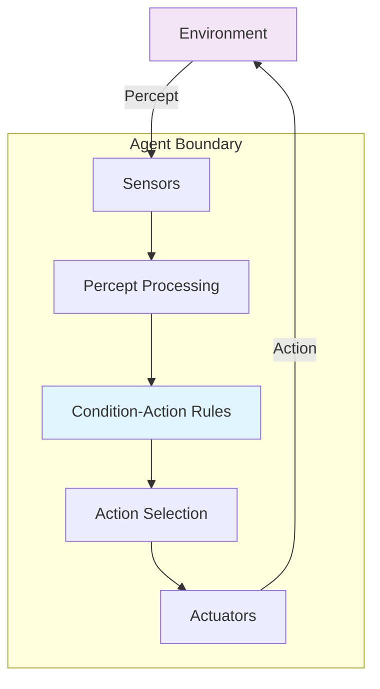

# Simple Reflex Agents

**Updated:** 2025-07-23

## TL;DR

* **Stimulus → action table**: Decisions are hard-coded condition–action rules with no deliberation
* **No internal state**: The agent perceives only the current environment snapshot, making decisions memoryless
* **Cheap and fast** but brittle; fails catastrophically when perception is partial, noisy, or incomplete
* **Foundational baseline** for understanding more sophisticated architectures: model-based, goal-based, and utility-based agents
* **Still relevant** in modern systems as micro-components within larger intelligent architectures

---

## Conceptual Foundation

### Definition and Core Principles

A **simple reflex agent** represents the most elementary form of rational agent behavior, operating on the principle of **stimulus-response mapping**. These agents implement a direct mapping from percept sequences to actions without any form of internal reasoning, planning, or state maintenance.

**Formal Definition:**
```
Agent: Percept → Action
f: P → A where f is a predetermined function
```

The agent function `f` is typically implemented as:
1. **Condition-action rules** (production rules)
2. **Lookup tables** for discrete state spaces
3. **Simple reactive functions** for continuous domains

### Philosophical Context

Simple reflex agents embody the **behaviorist approach** to intelligence, reminiscent of stimulus-response theories in psychology. They represent the computational equivalent of reflexive behaviors observed in biological systems - immediate, automatic responses to environmental stimuli without conscious deliberation.

This approach contrasts sharply with **cognitive architectures** that maintain internal models, engage in planning, or exhibit learning behaviors. Understanding reflex agents provides crucial insight into the baseline capabilities and fundamental limitations that motivated the development of more sophisticated agent architectures.

---

## PEAS Analysis Framework

The PEAS (Performance, Environment, Actuators, Sensors) framework provides a systematic approach to analyzing agent design requirements.

### Detailed PEAS Examples

#### Example 1: Vacuum-World Agent

| Component | Specification | Design Implications |
|-----------|---------------|-------------------|
| **Performance** | • Squares cleaned per time unit<br/>• Energy consumption minimization<br/>• Wear-and-tear on actuators | Requires trade-off between thoroughness and efficiency |
| **Environment** | • 2×N grid world<br/>• Dirt appears stochastically<br/>• Static topology | Finite state space enables complete rule enumeration |
| **Actuators** | • `MOVE_LEFT`, `MOVE_RIGHT`<br/>• `MOVE_UP`, `MOVE_DOWN`<br/>• `SUCK` | Limited action space simplifies control logic |
| **Sensors** | • Current location (discrete)<br/>• Dirt presence (boolean) | Perfect local observability but no global information |

#### Example 2: Thermostat Agent

| Component | Specification | Design Implications |
|-----------|---------------|-------------------|
| **Performance** | • Temperature stability (±1°F)<br/>• Energy efficiency<br/>• User comfort maintenance | Requires hysteresis to avoid oscillation |
| **Environment** | • Room with thermal dynamics<br/>• External temperature variations<br/>• Heat sources and sinks | Continuous state space with time delays |
| **Actuators** | • Heater ON/OFF<br/>• AC ON/OFF<br/>• Fan speed control | Binary/discrete control in continuous domain |
| **Sensors** | • Temperature sensor<br/>• Humidity sensor (optional)<br/>• Occupancy sensor (optional) | Sensor noise affects rule thresholds |

#### Example 3: Traffic Light Controller

| Component | Specification | Design Implications |
|-----------|---------------|-------------------|
| **Performance** | • Traffic throughput maximization<br/>• Safety (accident prevention)<br/>• Fairness across directions | Multiple competing objectives require prioritization |
| **Environment** | • Intersection with 4 directions<br/>• Variable traffic patterns<br/>• Emergency vehicle priority | Temporal dependencies challenge pure reflexive behavior |
| **Actuators** | • Light state changes<br/>• Pedestrian signals<br/>• Emergency preemption | Safety-critical timing constraints |
| **Sensors** | • Vehicle detection loops<br/>• Pedestrian buttons<br/>• Emergency vehicle signals | Multiple sensor modalities with different reliabilities |

---

## Architecture and Implementation

### Core Architecture



### Implementation Patterns

#### 1. Rule-Based Implementation

```python
class SimpleReflexAgent:
    def __init__(self, rules):
        """
        Initialize with condition-action rules.
        
        Args:
            rules: Dict mapping percept tuples to actions
        """
        self.rules = rules
        self.performance_measure = 0
        self.action_count = 0
    
    def perceive(self, environment):
        """Extract relevant features from environment state."""
        # In practice, this might involve sensor fusion,
        # noise filtering, or feature extraction
        return environment.get_percept()
    
    def decide(self, percept):
        """Map percept directly to action via rule lookup."""
        self.action_count += 1
        return self.rules.get(percept, "NO-OP")
    
    def act(self, action, environment):
        """Execute action and update performance measure."""
        result = environment.execute_action(action)
        self.performance_measure += self.evaluate_outcome(result)
        return result
    
    def evaluate_outcome(self, result):
        """Simple performance evaluation."""
        # Implementation depends on specific domain
        return 1 if result.success else -1
```

#### 2. Enhanced Vacuum World Implementation

```python
class VacuumReflexAgent(SimpleReflexAgent):
    def __init__(self):
        # Comprehensive rule set for vacuum world
        rules = {
            # Format: (location, dirt_present, battery_level) -> action
            ("A", True, "HIGH"): "SUCK",
            ("A", True, "LOW"): "SUCK",  # Prioritize cleaning
            ("A", False, "HIGH"): "RIGHT",
            ("A", False, "LOW"): "RECHARGE",
            ("B", True, "HIGH"): "SUCK",
            ("B", True, "LOW"): "SUCK",
            ("B", False, "HIGH"): "LEFT",
            ("B", False, "LOW"): "RECHARGE",
            ("DOCK", False, "LOW"): "RECHARGE",
            ("DOCK", False, "HIGH"): "LEFT",  # Resume cleaning
        }
        super().__init__(rules)
        self.squares_cleaned = 0
        self.energy_consumed = 0
    
    def perceive(self, environment):
        """Enhanced perception with battery monitoring."""
        base_percept = super().perceive(environment)
        battery_level = "HIGH" if environment.battery > 0.3 else "LOW"
        return (base_percept[0], base_percept[1], battery_level)
    
    def evaluate_outcome(self, result):
        """Domain-specific performance evaluation."""
        score = 0
        if result.action == "SUCK" and result.dirt_removed:
            score += 10  # Primary objective
            self.squares_cleaned += 1
        elif result.action in ["LEFT", "RIGHT"]:
            score -= 1   # Movement cost
        elif result.action == "RECHARGE":
            score -= 2   # Recharging cost
        
        self.energy_consumed += result.energy_cost
        return score
```

#### 3. Continuous Domain Example: Obstacle Avoidance

```python
import numpy as np

class ObstacleAvoidanceAgent(SimpleReflexAgent):
    def __init__(self, safe_distance=1.0):
        self.safe_distance = safe_distance
        # Rules are implicit in the decision function
        super().__init__({})
    
    def perceive(self, environment):
        """Perceive obstacles via distance sensors."""
        return {
            'front': environment.distance_to_obstacle('front'),
            'left': environment.distance_to_obstacle('left'),
            'right': environment.distance_to_obstacle('right'),
            'speed': environment.current_speed
        }
    
    def decide(self, percept):
        """Reactive obstacle avoidance using potential fields."""
        front_dist = percept['front']
        left_dist = percept['left']
        right_dist = percept['right']
        
        # Simple reflex rules for obstacle avoidance
        if front_dist < self.safe_distance:
            if left_dist > right_dist:
                return "TURN_LEFT"
            else:
                return "TURN_RIGHT"
        elif front_dist < 2 * self.safe_distance:
            return "SLOW_DOWN"
        else:
            return "MOVE_FORWARD"
```

---

## Strengths and Capabilities

### 1. Computational Efficiency

**Time Complexity**: O(1) decision making regardless of environment complexity
- **Lookup table**: Direct indexing provides constant-time access
- **Rule evaluation**: Sequential rule matching with early termination
- **Memory usage**: Minimal memory footprint for rule storage

**Real-time Performance**: Suitable for time-critical applications
- **Deterministic response time**: Predictable worst-case execution time
- **No search overhead**: Unlike planning-based agents
- **Hardware implementation**: Can be implemented in simple embedded systems

### 2. Transparency and Explainability

**Complete Interpretability**: Every decision can be traced to a specific rule
```python
def explain_decision(agent, percept, action):
    """Provide explanation for agent's decision."""
    rule = agent.rules.get(percept)
    return f"Given percept {percept}, rule '{percept} → {action}' was applied"
```

**Verification and Validation**: 
- **Formal verification**: Rule sets can be formally analyzed for completeness and consistency
- **Safety analysis**: Critical rules can be verified against safety properties
- **Regulatory compliance**: Transparent decision logic aids regulatory approval

### 3. Design Simplicity

**Implementation Ease**: Minimal complexity for well-defined domains
- **No learning algorithms**: Avoids complexity of training procedures
- **No state management**: Eliminates bugs related to state inconsistency
- **Modular rules**: Easy to add, remove, or modify individual rules

### 4. Robustness in Specific Scenarios

**Sensor Failure Handling**: Can incorporate default behaviors
```python
def robust_perceive(self, environment):
    """Perception with sensor failure handling."""
    try:
        return environment.get_percept()
    except SensorFailure:
        return self.default_percept  # Safe fallback
```

---

## Limitations and Failure Modes

### 1. Partial Observability

**Problem**: Agents cannot maintain information about unobserved parts of the environment.

**Example**: A vacuum agent cannot remember which rooms it has already cleaned
```python
# This fails - no memory of visited locations
current_percept = ("A", False)  # Clean room A
action = rules[current_percept]  # "RIGHT" 
# Agent moves to B, then back to A
# Will re-clean A unnecessarily because it forgot it was already clean
```

**Consequences**:
- **Infinite loops**: Agent may cycle between locations
- **Inefficient behavior**: Redundant actions in large environments
- **Inability to handle temporal dependencies**: Cannot coordinate actions over time

### 2. Noisy and Uncertain Sensors

**Problem**: Real-world sensors provide imperfect information

```python
# Brittle rule that fails with sensor noise
rules = {
    ("A", True): "SUCK",   # Works only if dirt detection is perfect
    ("A", False): "RIGHT"  # May miss dirt due to sensor noise
}

# Robust alternative requires probabilistic reasoning
# which exceeds simple reflex capabilities
```

**Failure Scenarios**:
- **False positives**: Acting on phantom percepts
- **False negatives**: Missing important environmental features
- **Sensor drift**: Rules become invalid as sensors age

### 3. Dynamic Environments

**Problem**: Rule sets become obsolete as environments change

**Example**: Traffic patterns changing due to construction
```python
# Rules optimized for normal traffic
traffic_rules = {
    ("peak_hour", "heavy_traffic"): "EXTEND_GREEN",
    ("off_peak", "light_traffic"): "NORMAL_TIMING"
}

# Fails when construction reroutes traffic
# New patterns not captured in original rule set
```

### 4. Scaling Challenges

**State Space Explosion**: Rule sets grow exponentially with percept dimensionality
```
n boolean sensors → 2^n possible percepts → 2^n rules needed
```

**Example**:
- 5 sensors: 32 rules
- 10 sensors: 1,024 rules  
- 20 sensors: 1,048,576 rules

**Maintenance Complexity**: 
- **Rule conflicts**: Overlapping conditions leading to ambiguous behavior
- **Incomplete coverage**: Missing rules for edge cases
- **Testing complexity**: Exponential test case requirements

### 5. No Learning or Adaptation

**Static Behavior**: Cannot improve performance through experience
```python
# Agent repeats same mistakes indefinitely
for episode in range(1000):
    percept = environment.get_percept()
    action = agent.decide(percept)  # Same rules every time
    environment.execute(action)
    # No learning from outcomes
```

**Missed Optimization Opportunities**:
- Cannot discover more efficient action sequences
- Cannot adapt to user preferences
- Cannot handle novel situations not anticipated by designers

---

## Advanced Considerations

### 1. Rule Representation and Organization

#### Hierarchical Rule Structures
```python
class HierarchicalReflexAgent:
    def __init__(self):
        self.priority_rules = {
            # Safety rules (highest priority)
            "EMERGENCY": {"obstacle_detected": "STOP"},
            # Task rules (medium priority)
            "TASK": {"goal_visible": "APPROACH"},
            # Maintenance rules (lowest priority)  
            "MAINTENANCE": {"battery_low": "RECHARGE"}
        }
    
    def decide(self, percept):
        # Check rules in priority order
        for priority in ["EMERGENCY", "TASK", "MAINTENANCE"]:
            for condition, action in self.priority_rules[priority].items():
                if self.evaluate_condition(condition, percept):
                    return action
        return "NO-OP"
```

#### Pattern-Based Rules
```python
import re

class PatternReflexAgent:
    def __init__(self):
        self.pattern_rules = [
            (re.compile(r"emergency.*"), "EMERGENCY_STOP"),
            (re.compile(r"target_.*_visible"), "APPROACH"),
            (re.compile(r".*_blocked"), "FIND_ALTERNATIVE")
        ]
    
    def decide(self, percept_string):
        for pattern, action in self.pattern_rules:
            if pattern.match(percept_string):
                return action
        return "DEFAULT_ACTION"
```

### 2. Performance Optimization

#### Rule Compilation and Optimization
```python
class OptimizedReflexAgent:
    def __init__(self, rules):
        # Compile rules into decision tree for O(log n) lookup
        self.decision_tree = self.compile_rules(rules)
        self.rule_usage_stats = {}
    
    def compile_rules(self, rules):
        """Convert rule table to optimized decision tree."""
        # Implementation would build binary decision tree
        # to minimize expected lookup time
        pass
    
    def decide(self, percept):
        action = self.decision_tree.lookup(percept)
        # Track rule usage for optimization
        rule_key = (percept, action)
        self.rule_usage_stats[rule_key] = \
            self.rule_usage_stats.get(rule_key, 0) + 1
        return action
```

### 3. Hybrid Architectures

#### Reflex Components in Complex Agents
```python
class HybridAgent:
    def __init__(self):
        self.reflex_layer = SimpleReflexAgent(emergency_rules)
        self.deliberative_layer = PlanningAgent()
        self.learning_layer = ReinforcementLearner()
    
    def decide(self, percept):
        # Emergency reflexes take precedence
        emergency_action = self.reflex_layer.decide(percept)
        if emergency_action != "NO-OP":
            return emergency_action
        
        # Fall back to deliberative planning
        planned_action = self.deliberative_layer.plan(percept)
        if planned_action is not None:
            return planned_action
        
        # Use learned policy as last resort
        return self.learning_layer.act(percept)
```

---

## Modern Applications and Relevance

### 1. Microservice Architectures

In modern distributed systems, simple reflex agents serve as **reactive microservices**:

```python
# API Gateway with reflex-based routing
routing_rules = {
    ("POST", "/api/auth"): "auth_service",
    ("GET", "/api/users"): "user_service", 
    ("POST", "/api/orders"): "order_service"
}

def route_request(method, path):
    return routing_rules.get((method, path), "default_service")
```

### 2. Edge Computing and IoT

**Resource-constrained devices** benefit from reflex agents' minimal overhead:

```python
# IoT sensor with reflex-based data transmission
class IoTSensorAgent:
    def __init__(self):
        self.transmission_rules = {
            ("critical", "connected"): "TRANSMIT_IMMEDIATELY",
            ("normal", "connected"): "BATCH_TRANSMIT",
            ("any", "disconnected"): "STORE_LOCALLY"
        }
    
    def handle_sensor_reading(self, reading, connectivity):
        priority = "critical" if reading.value > threshold else "normal"
        status = "connected" if connectivity.is_online() else "disconnected"
        return self.transmission_rules[(priority, status)]
```

### 3. Safety-Critical Systems

**Reflex agents provide fail-safe behaviors** in safety-critical applications:

```python
# Nuclear reactor safety system
safety_rules = {
    ("temperature", "CRITICAL"): "EMERGENCY_SHUTDOWN",
    ("pressure", "HIGH"): "RELEASE_PRESSURE", 
    ("radiation", "ELEVATED"): "SEAL_CONTAINMENT"
}

# These rules must be simple, verifiable, and reliable
```

### 4. LLM Integration Patterns

Modern AI systems integrate reflex agents as **safety filters** and **response modulators**:

```python
class LLMSafetyWrapper:
    def __init__(self, llm_model):
        self.llm = llm_model
        self.safety_reflexes = {
            "harmful_content_detected": "REFUSE_RESPONSE",
            "personal_info_requested": "REDIRECT_TO_PRIVACY",
            "off_topic_query": "REDIRECT_TO_SCOPE"
        }
    
    def generate_response(self, user_input):
        # Quick reflex check before expensive LLM inference
        safety_assessment = self.assess_safety(user_input)
        reflex_action = self.safety_reflexes.get(safety_assessment)
        
        if reflex_action:
            return self.execute_safety_action(reflex_action)
        
        # Proceed with full LLM generation
        return self.llm.generate(user_input)
```

---

## Comparative Analysis

### Reflex vs. Model-Based Agents

| Aspect | Simple Reflex | Model-Based Reflex |
|--------|---------------|-------------------|
| **Memory** | None | Maintains internal state |
| **Perception** | Current only | Current + history |
| **Complexity** | O(1) | O(state_size) |
| **Flexibility** | Low | Medium |
| **Example** | Thermostat | Robot with world model |

### Reflex vs. Goal-Based Agents

| Aspect | Simple Reflex | Goal-Based |
|--------|---------------|------------|
| **Planning** | None | Search-based |
| **Adaptability** | None | High |
| **Computation** | Minimal | Intensive |
| **Optimality** | Not guaranteed | Depends on search |
| **Example** | Traffic light | Route planning |

### Reflex vs. Utility-Based Agents

| Aspect | Simple Reflex | Utility-Based |
|--------|---------------|---------------|
| **Decision Criterion** | Rule matching | Utility maximization |
| **Trade-offs** | None | Explicit |
| **Uncertainty** | Ignored | Handled via expected utility |
| **Learning** | None | Can learn utility functions |
| **Example** | Smoke detector | Investment advisor |

---

## Evaluation Metrics

### Performance Measures

1. **Response Time**: Time from percept to action
2. **Action Accuracy**: Percentage of correct actions
3. **Rule Coverage**: Fraction of percept space covered by rules
4. **Rule Conflicts**: Number of ambiguous situations

### Benchmarking Environments

```python
class ReflexAgentBenchmark:
    def __init__(self):
        self.test_environments = [
            VacuumWorld(size=(2,2)),
            GridWorld(obstacles=0.1),
            ContinuousControl(noise_level=0.05)
        ]
    
    def evaluate_agent(self, agent, episodes=1000):
        results = {}
        for env in self.test_environments:
            scores = []
            for _ in range(episodes):
                score = self.run_episode(agent, env)
                scores.append(score)
            results[env.name] = {
                'mean_score': np.mean(scores),
                'std_score': np.std(scores),
                'success_rate': sum(s > 0 for s in scores) / episodes
            }
        return results
```

---

## Design Guidelines and Best Practices

### 1. Rule Design Principles

**Completeness**: Ensure rules cover all possible percepts
```python
def validate_rule_completeness(rules, percept_space):
    """Check if rules cover entire percept space."""
    covered = set(rules.keys())
    total = set(percept_space)
    missing = total - covered
    if missing:
        print(f"Warning: Missing rules for percepts: {missing}")
    return len(missing) == 0
```

**Consistency**: Avoid conflicting rules
```python
def check_rule_consistency(rules):
    """Detect potential rule conflicts."""
    conflicts = []
    for percept in rules:
        if isinstance(rules[percept], list):
            conflicts.append(f"Ambiguous rules for {percept}")
    return conflicts
```

**Minimalism**: Use the smallest rule set that achieves objectives
```python
def minimize_rule_set(rules, test_cases):
    """Remove redundant rules while maintaining performance."""
    essential_rules = {}
    for rule_key, action in rules.items():
        # Test if removing this rule affects performance
        temp_rules = {k: v for k, v in rules.items() if k != rule_key}
        if evaluate_performance(temp_rules, test_cases) < threshold:
            essential_rules[rule_key] = action
    return essential_rules
```

### 2. Error Handling

**Graceful Degradation**: Handle unexpected percepts
```python
def robust_reflex_agent(percept, rules, default_action="WAIT"):
    """Reflex agent with fallback behavior."""
    if percept in rules:
        return rules[percept]
    else:
        # Log unexpected percept for rule refinement
        log_unexpected_percept(percept)
        return default_action
```

**Sensor Validation**: Verify percept validity
```python
def validate_percept(percept):
    """Validate percept before rule application."""
    if percept is None:
        raise SensorError("Null percept received")
    if not isinstance(percept, tuple):
        raise SensorError("Invalid percept format")
    return True
```

### 3. Testing and Validation

**Unit Testing**: Test individual rules
```python
def test_vacuum_rules():
    rules = get_vacuum_rules()
    assert rules[("A", True)] == "SUCK"
    assert rules[("A", False)] == "RIGHT"
    assert rules[("B", True)] == "SUCK"
    assert rules[("B", False)] == "LEFT"
```

**Integration Testing**: Test agent behavior in realistic scenarios
```python
def test_agent_behavior():
    agent = VacuumReflexAgent()
    environment = VacuumWorld(dirt_probability=0.3)
    
    total_score = 0
    for episode in range(100):
        score = run_episode(agent, environment)
        total_score += score
    
    average_score = total_score / 100
    assert average_score > minimum_acceptable_score
```

---

## Exercises and Extensions

### Programming Exercises

1. **Implement a traffic light controller** with emergency vehicle preemption
2. **Design a stock trading agent** with simple technical analysis rules
3. **Create a chatbot** with reflex-based intent classification
4. **Build a game AI** for Tic-Tac-Toe using only condition-action rules

### Theoretical Questions

1. **Prove or disprove**: A simple reflex agent can be optimal in fully observable, deterministic environments
2. **Analyze the computational complexity** of rule compilation for large rule sets
3. **Design a formal specification** for verifying reflex agent safety properties
4. **Compare the expressiveness** of different rule representation formats

### Research Directions

1. **Machine learning for rule discovery**: Can we automatically learn reflex rules from demonstrations?
2. **Adaptive rule priorities**: How can rule priorities change based on context?
3. **Distributed reflex systems**: Coordinating multiple reflex agents without central control
4. **Quantum reflex agents**: Leveraging quantum superposition for parallel rule evaluation

---

## Summary and Connections

Simple reflex agents, despite their limitations, provide crucial insights into the foundations of intelligent behavior. They demonstrate that **intelligent-seeming behavior can emerge from simple rules**, a principle that scales to modern AI systems where complex behaviors emerge from combinations of simple components.

**Key Takeaways**:

1. **Simplicity has value**: In well-defined, stable environments, simple solutions often outperform complex ones
2. **Foundational understanding**: Grasping reflex agents illuminates the limitations that drive more sophisticated architectures
3. **Modern relevance**: Reflex components remain valuable in hybrid systems, safety-critical applications, and resource-constrained environments
4. **Design principles**: Rules for transparency, robustness, and maintainability apply across AI system complexity levels

The journey from simple reflex agents to modern LLM-based systems illustrates the evolution of AI architectures, each addressing specific limitations of previous approaches while introducing new capabilities and complexities.

---

## Q & A

**Q: Why do simple reflex agents violate the separation of concerns principle?**  
**A:** Knowledge representation (rules) and control logic (decision function) are tightly coupled in the rule table. This makes maintenance difficult because domain knowledge changes require modifying the control structure, and vice versa. Modern architectures separate knowledge bases from inference engines to improve modularity.

**Q: How can a reflex agent be extended to cope with unseen percepts?**  
**A:** Several approaches exist: (1) Add default rules with safe fallback behaviors, (2) Upgrade to model-based reflex by maintaining state, (3) Implement hierarchical rules with catch-all patterns, (4) Use similarity-based matching for near-miss percepts, or (5) Integrate with learning mechanisms to acquire new rules online.

**Q: Can simple reflex agents exhibit optimal behavior?**  
**A:** Yes, in environments that are fully observable, deterministic, and where the optimal policy is stateless (Markovian). For example, a thermostat can be optimal if it only needs current temperature to make heating decisions. However, most real-world environments require state memory for optimal behavior.

**Q: How do reflex agents handle real-time constraints?**  
**A:** Their O(1) decision time makes them naturally suited for hard real-time systems. Unlike planning-based agents that may exceed time deadlines during complex reasoning, reflex agents provide predictable, bounded response times essential for safety-critical applications.

**Q: What is the relationship between reflex agents and reactive programming paradigms?**  
**A:** Reflex agents embody reactive programming principles: responding to events (percepts) without internal state management. Modern reactive systems like event-driven architectures and functional reactive programming extend these ideas to distributed systems and user interfaces.

**Q: How do we validate that a reflex agent's rule set is complete and consistent?**  
**A:** Formal verification techniques can be applied: (1) Completeness checking ensures all possible percepts have corresponding rules, (2) Consistency analysis detects conflicting rules, (3) Safety verification proves that unsafe states are unreachable, and (4) Liveness verification ensures progress toward goals. Model checking tools can automate these analyses for finite state spaces.

---

