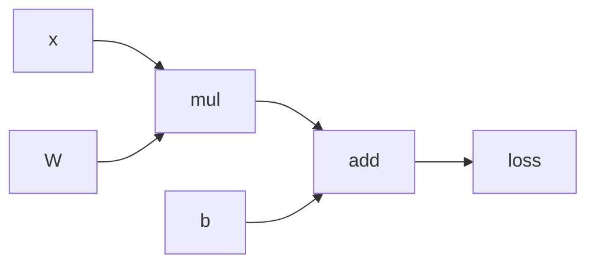

# Automatic Differentiation (Autograd)

**Updated:** 2025‑07‑26

## TL;DR

* **Goal:** Get gradients *automatically*—no hand‑derived math.
* **Idea:** Record every elementary operation in a *computational graph* during the forward pass, then apply the chain rule backward.
* **Reverse‑mode autograd** (used for deep nets) computes all parameter gradients with roughly the cost of one extra forward run.
* Frameworks like **PyTorch**, **TensorFlow 2**, and **JAX** wrap tensors so this recording happens under the hood.

---

## Why do we need autograd?

> Training = tweaking millions of weights so the loss gets smaller.

Hand‑coding $\partial \mathcal L / \partial w$ for each layer is error‑prone and impossible at GPT scale. Autograd gives us those derivatives “for free,” letting us focus on model ideas, not calculus.

---

## The core recipe (reverse‑mode)

1. **Forward pass** – compute output and *silently* build a graph of operations.
2. **Seed gradient at the loss** – set $\partial \mathcal L / \partial \mathcal L = 1$.
3. **Walk graph backward** – apply the chain rule to every node, caching $\partial \mathcal L / \partial x$ for its inputs.
4. **Store gradients on parameters** – the optimiser reads these and updates weights.

Because each edge is visited once forward and once backward, runtime is \~2× a forward pass.

---

## Minimal PyTorch demo

```python
import torch

x = torch.tensor([2.0], requires_grad=True)
W = torch.tensor([3.0], requires_grad=True)
b = torch.tensor([1.0], requires_grad=True)

y_hat = W * x + b        # forward: graph recorded
loss = (y_hat - 7)**2    # simple MSE

loss.backward()          # autograd magic ➜ fill .grad fields
print(W.grad)            # tensor([ -8.])
print(b.grad)            # tensor([ -4.])
```

`requires_grad=True` tells PyTorch to wrap each tensor in a **`LeafVariable`** whose operations get tracked.

---

## How recording works (conceptual)



Each node saves just two things:

* **Value** from the forward pass.
* **Function** to compute local gradients given upstream gradient.

During `backward()`, gradients trickle from **L** to **A** to **M** to **X / W / b**.

---

## Common questions

| Q                                                        | A                                                                               |
| -------------------------------------------------------- | ------------------------------------------------------------------------------- |
| *Why not numerical finite differences?*                  | Need a forward eval per parameter → millions of passes; also noisy.             |
| *Does autograd store the whole graph in memory?*         | Yes, but you can `torch.no_grad()` or `detach()` to cut off parts and save RAM. |
| *What if I want forward‑mode (Jacobian‑vector product)?* | JAX and PyTorch’s `forward_ad` support it, handy when outputs ≫ parameters.     |

---

## Pitfalls & tips

* **In‑place ops** can break the recorded graph; use functional APIs when unsure.
* Forgetting `requires_grad` on inputs means gradients come back as `None`.
* Wrap evaluation loops with `torch.no_grad()` to save memory – no graph needed.

---

